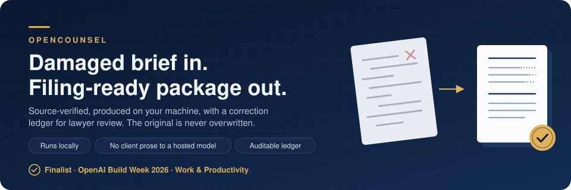
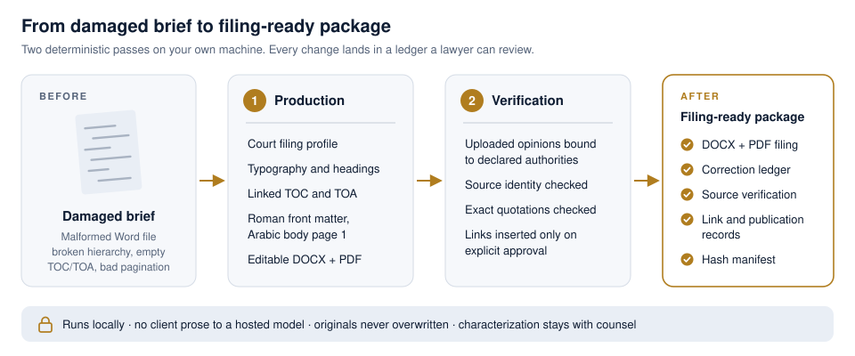
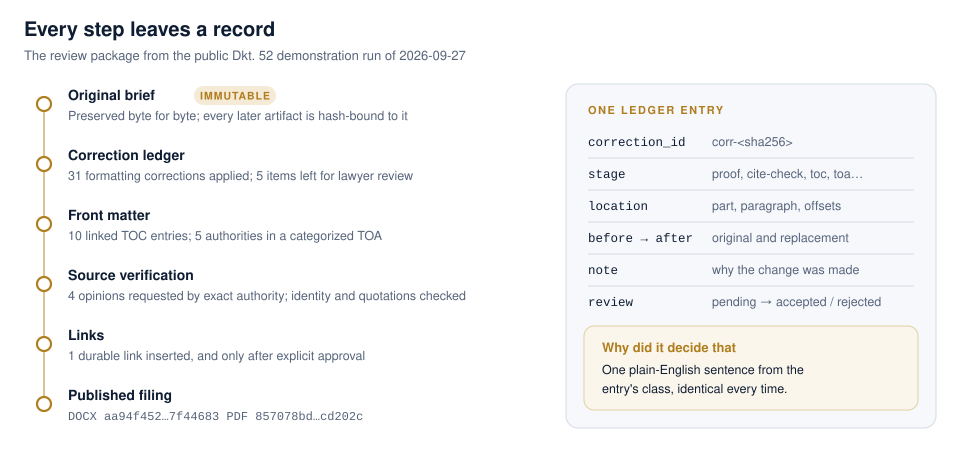
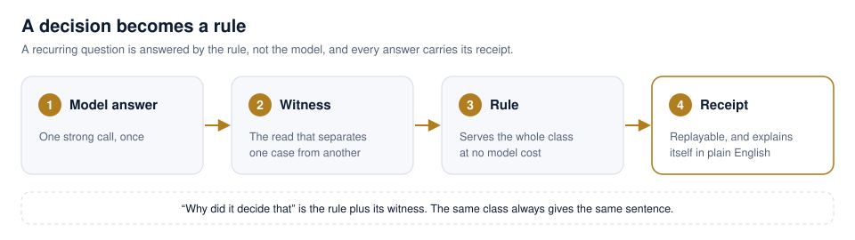

<p align="center">
  
</p>

# OpenCounsel

**Damaged brief in. Source-verified, filing-ready package out, on your own machine.**

<p align="center">
  <a href="#see-it">See it</a> ·
  <a href="#why-opencounsel">Why OpenCounsel</a> ·
  <a href="#the-method-and-the-patent">The method</a> ·
  <a href="#who-it-is-for">Who it is for</a> ·
  <a href="#contact">Contact</a>
</p>

OpenCounsel repairs the Word production of a brief, builds linked tables of contents and
authorities, checks the opinions you upload against what the brief cites, and hands back one
package with a correction ledger for lawyer review. It runs locally, sends no client prose to a
hosted model, and never overwrites the original.

**[Finalist, OpenAI Build Week (Work & Productivity)](https://developers.openai.com/blog/build-week-winners)**,
selected from 8,000+ projects by ~47,000 builders. OpenAI's announcement: *"OpenCounsel turns
damaged legal briefs into source-verified, filing-ready packages."* Patent pending.

## The problem

A brief can be finished on the merits and still fail on the last mile.

- **Filings bounce** for formatting, pagination and linking defects (S.D.N.Y., *Electronic Case
  Filing Rules & Instructions*).
- **Cite-checking and the table of authorities eat hours** against *The Bluebook* (21st ed. 2020).
- **Hallucinated citations draw sanctions.** *Mata v. Avianca, Inc.*, No. 22-cv-1461 (PKC)
  (S.D.N.Y. June 22, 2023); *Park v. Kim*, 91 F.4th 610 (2d Cir. 2024).
- **Courts want to know how AI was used.** Judge Brantley Starr (N.D. Tex.), *Mandatory
  Certification Regarding Generative Artificial Intelligence* (May 30, 2023).
- **The duty stays with the lawyer.** ABA Formal Opinion 512 (July 29, 2024) puts competence,
  confidentiality and supervision on counsel; sending client matter to a hosted model trades one
  risk for another.
- **The record has to exist.** Rule 11's reasonable inquiry is answered on paper, not from memory
  (Fed. R. Civ. P. 11(b)).

Every pain, its answer, the evidence and the source: [docs/PAIN_POINTS.md](docs/PAIN_POINTS.md).

## What you get

<p align="center">
  
</p>

- **A filing that clears the clerk's checklist.** Court typography and heading hierarchy, a linked
  table of contents, a categorized table of authorities, Roman front matter and Arabic body page 1,
  as editable DOCX and PDF.
- **Citations checked against the source.** Each uploaded opinion is bound to the authority it
  claims to be, and its identity and the brief's exact quotations are checked. Anything mismatched,
  undeclared or malformed is refused, not softened.
- **A ledger, not silent edits.** Every change is an entry the lawyer can accept or reject.
- **One package to hand over.** The review ZIP holds the filing and its correction, publication,
  source-verification, link and hash records.

## Why OpenCounsel

<p align="center">
  
</p>

- **Private by default.** One locked-down container on your machine. Network and model access are
  switched off in the service contract, so client matter never leaves the building.
- **Auditable by construction.** The original is immutable, every artifact is hash-bound to its
  inputs, and every correction carries its review status. An AI-use certification can be written
  from the receipts instead of from memory.
- **Honest about what it verified.** Identity and exact quotations are checked mechanically. A
  hyperlink is navigation, not proof of support, and whether a case supports a characterization
  stays the lawyer's call.
- **Deterministic.** The same input gives the same output, and each automated decision explains
  itself in the same plain-English sentence every time.

## See it

Docker is the only prerequisite. No host Python, PostgreSQL, or LibreOffice installation is required.

```console
docker compose up --build --detach
docker compose ps
```

When the `opencounsel` service reports `healthy`, open `http://127.0.0.1:8765` and select
**Run the OpenAI filing demo**. The demo uses a privacy-safe reconstruction of OpenAI Defendants'
public February 26, 2024 Dkt. 52 motion in *The New York Times Company v. Microsoft Corporation*.
On the 2026-09-27 verification run it produced an 8-page filing with 10 TOC entries, 5 TOA
authorities, 31 formatting corrections and 5 items for review, in about ten seconds
([receipt](docs/PUBLISH_READINESS.md)).

<details>
<summary>Readiness check, stopping and cleanup</summary>

In GitHub Codespaces, open the private forwarded URL for port `8765`; do not make the port public.

```console
curl --fail http://127.0.0.1:8765/healthz   # readiness
docker compose down                          # stop, keeping the opencounsel-data workspace
docker compose down --volumes                # remove the service and the whole workspace
```

</details>

## Who it is for

- **Managing partners** who carry the sanctions and supervision risk and want a record of how each
  filing was produced.
- **Litigation-support leads** who spend the night before a deadline on tables, pagination and
  cite-checks.
- **Legal-operations and IT buyers** who need automation that keeps client matter in-house and
  behaves the same way every time.
- **Investors** looking at a finalist-recognized product with a patent-pending method.

## The method and the patent

Most AI tools answer the same question from scratch every time. OpenCounsel keeps a record
instead: whenever it decides something, it writes down what it looked at and what it found, next
to the answer. That record is what a buyer pays for.

- **Repeat checks are served from a recorded rule, with a receipt.** When the same check comes up
  on the same inputs, the recorded answer is served, and the receipt shows exactly why.
- **Only new cases reach a model.** Work is redone only when something it depended on has changed,
  so the fresh work, and its cost, shrinks as the record grows.
- **Every explanation is the same sentence every time.** The "Why did it decide that" panel turns
  each decision into one plain-English sentence plus the fact that decided it, read from the record
  rather than generated afresh (`opencounsel.explain`).

This is the subject of a **US provisional patent application filed by Stephen Schweizer (September
2026), patent pending**, titled *"Recording reads beside stored results to control reuse and
recomputation, and testing kept reads as a key against the answers owed."* In its words:

> The method described here puts one question to every request: given everything already learned
> and checked, what is the least new work that produces this answer now?

<p align="center">
  
</p>

## Roadmap

**Today:** a private, local, single-user product for S.D.N.Y./E.D.N.Y. motion memoranda.
**Next** ([docs/ROADMAP.md](docs/ROADMAP.md)): a record-citation workbench; more court and judge
profiles; verified proposition support with point-in-time law, kept apart from the mechanical
identity and quotation checks; reviewed-Word reconciliation; and a practice control plane for
deadlines, tasks and privilege review.

## Contact

Pilots, licensing, partnership and investment: **stephen.schweizer [at] gmail [dot] com**

The one-page brief: [docs/BRIEF.md](docs/BRIEF.md).

---

## For reviewers and developers

<details>
<summary>The two passes in detail</summary>

**First pass — filing production.** OpenCounsel preserves the malformed source, applies the
S.D.N.Y./E.D.N.Y. motion-memorandum profile, normalizes typography and heading hierarchy, compiles a
linked TOC and categorized TOA, and publishes editable DOCX plus reference PDF. Roman front matter
is followed by Arabic body page 1. Intake requires either an explicit no-record declaration or a
validated record package; the no-record route does not weaken record-backed validation.

**Second pass — source verification.** The demo declares four stable authority IDs and prepared
public opinion PDFs. OpenCounsel rejects mismatched, undeclared, duplicate, malformed, encrypted,
symlinked, and oversized inputs; checks source identity and exact quotations; classifies embedded
links separately; and requires explicit approval before inserting an eligible durable link.

The result includes separate linked DOCX/PDF outputs and a final review ZIP with correction,
publication, acquisition, source-verification, link, and hash records. Characterization remains
explicitly for lawyer review. A hyperlink is navigation evidence, not proof of substantive support.

</details>

<details>
<summary>Trust and privacy boundary</summary>

The demonstrated pipeline is local-first and sends no client prose to a hosted model. Deterministic
validators own file safety, page labels, citations, provenance, links, and artifact hashes. It does
not scrape publishers, require publisher credentials, overwrite an upload, or silently approve a
legal characterization.

No client file or client-derived fixture belongs in this repository. The demonstration uses only a
privacy-safe reconstruction of OpenAI Defendants' public February 26, 2024 Dkt. 52 motion in *The
New York Times Company v. Microsoft Corporation* and generated public support files.

The browser binds to loopback. The container runs non-root with a read-only filesystem, dropped
capabilities, and `no-new-privileges`. Those controls reduce risk; they do not themselves create or
preserve privilege.

</details>

<details>
<summary>Current limits and licensing</summary>

This is a local, single-user demonstration. The repository is public, but the demonstrated product
keeps client matter on the user's machine. Reviewed-Word reconciliation, additional court profiles,
hosted deployment, native installers, OCR, accounts, billing, and multi-matter service are outside
the submission scope.

OpenCounsel is designed toward a future open-source release, but this repository is not currently
open source or FOSS. No license is granted and all rights are reserved unless and until an actual
license is selected and committed.

</details>

<details>
<summary>Publishing</summary>

This repository is the audited public cut. It was regrown from an audited tree without private
development ancestry. Future public updates remain gated by the privilege audit, a deterministic
scan of every file and history blob (`python3 scripts/privilege_audit.py --root .`), with the
manifest of retained legal fixtures and their public sources in `docs/LEGAL_FIXTURES.json` and the
checklist in [docs/PUBLISH_READINESS.md](docs/PUBLISH_READINESS.md).

</details>

<details>
<summary>Development gate</summary>

```console
uv lock --check
uv run ruff check .
uv run mypy src
uv run pytest --cov=opencounsel --cov-report=term-missing
uv build
python3 scripts/privilege_audit.py --root .
uv run python scripts/build_style_review.py --out /tmp/opencounsel-style-review
```

</details>

<details>
<summary>Development provenance</summary>

Initial architecture and implementation were developed during the contest period with GPT-5.6
through ChatGPT Work. This submitted Codex session served as the principal contest-finalization and
release-engineering session: it preserved and diagnosed the real LibreOffice failure, committed the
regression and fix separately, repaired clean-rehearsal integration contracts, verified the complete
two-pass Docker workflow and full gate, added the bounded recording close, and prepared the release.

Bounded clean-context work also produced PRs `#26` and `#27`; this primary session inspected them and
selectively integrated compatible documentation. The repository history—not one uninterrupted
transcript—is the authorship and verification record. See
[development provenance](docs/DEVELOPMENT_PROVENANCE.md) for the commit map.

</details>

### Documentation

- Buyer and release: [one-page brief](docs/BRIEF.md) · [pain-point map](docs/PAIN_POINTS.md) ·
  [roadmap](docs/ROADMAP.md) ·
  [publish-readiness checklist](docs/PUBLISH_READINESS.md) · [project state](docs/PROJECT_STATE.md) ·
  [Build Week recording and submission kit](docs/BUILD_WEEK_SUBMISSION.md)
- Product: [architecture](docs/ARCHITECTURE.md) · [brief pipeline](docs/BRIEF_PIPELINE.md) ·
  [authority acquisition and verification](docs/AUTHORITY_PIPELINE.md) ·
  [authority hyperlinking](docs/AUTHORITY_LINKS.md) · [front matter and Word fields](docs/FRONT_MATTER.md) ·
  [Word styles and filing profiles](docs/WORD_STYLES.md) ·
  [citation house style](docs/CITATION_HOUSE_STYLE.md) · [local browser interface](docs/WEB_INTERFACE.md) ·
  [local MCP boundary](docs/MCP.md)
- Engineering record: [publication engine decision](docs/PUBLICATION_ENGINE_DECISION.md) ·
  [real-document regression log](docs/REAL_DOCUMENT_REGRESSION_LOG.md) ·
  [reuse and license ledger](docs/REUSE.md) · [legal fixtures manifest](docs/LEGAL_FIXTURES.json) ·
  [development provenance](docs/DEVELOPMENT_PROVENANCE.md)